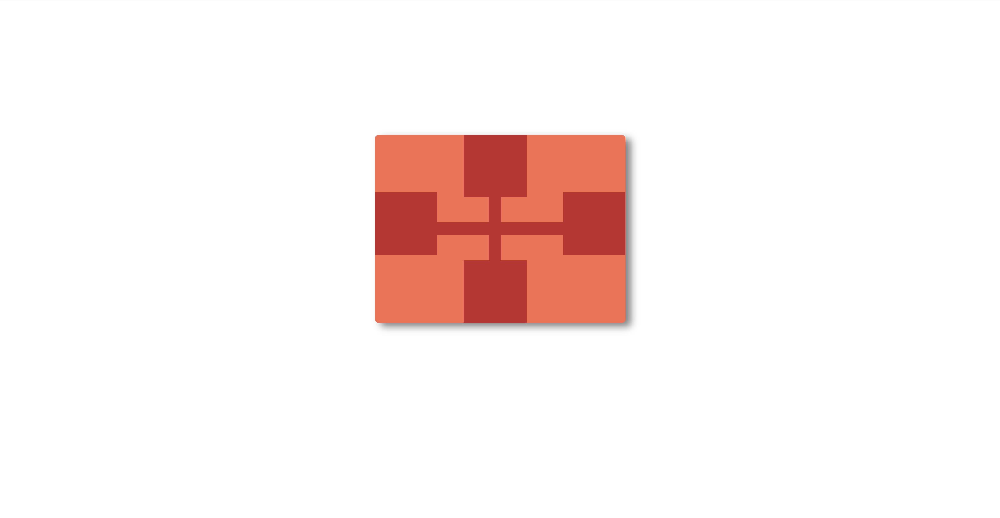

<h1>Red Cross Grid</h1>

<h2>Table of Contents</h2>
<ul>
    <li><a href="#introduction">Introduction</a></li>
    <li><a href="#challenge-description">Challenge Description</a></li>
    <li><a href="#purpose">Purpose</a></li>
    <li><a href="#prerequisites">Prerequisites</a></li>
    <li><a href="#file-structure">File Structure</a></li>
    <li><a href="#tools">Tools</a></li>
    <li><a href="#preview">Preview</a></li>
    <li><a href="#credits">Credits</a></li>
</ul>

<h2 id="introduction">Introduction</h2>

The 'Red Cross Grid' challenge involves creating a visual representation of a red cross inside a grid using HTML and CSS. This challenge helps in understanding the use of positioning, background colors, and the layout of HTML elements.

<h2 id="challenge-description">Challenge Description</h2>

This challenge focuses on creating a red cross inside a grid layout using only HTML and CSS. The goal is to position the squares and cross elements correctly to form the desired pattern. The layout is responsive and centered within the browser window.

<h2 id="purpose">Purpose</h2>

The purpose of this challenge is to:

<ul>
    <li>Improve skills in HTML and CSS.</li>
    <li>Practice CSS positioning and layout techniques.</li>
    <li>Understand responsive design principles.</li>
</ul>

<h2 id="prerequisites">Prerequisites</h2>

To complete this challenge, you should have a basic understanding of:

<ul>
    <li>HTML</li>
    <li>CSS</li>
    <li>CSS positioning properties</li>
</ul>

<h2 id="file-structure">File Structure</h2>

The project contains the following files:

<pre>
red-cross-grid/
│
├── index.html
└── styles.css
</pre>

<h2 id="tools">Tools</h2>

The following tools were used in this challenge:

<ul>
    <li>A code editor (e.g., VSCode)</li>
    <li>A web browser for viewing the demo</li>
</ul>

<h2 id="preview">Preview</h2>

Live demo: <a href="https://codepen.io/Yashi-the-lessful/pen/bGyXdgK" target="_blank">Red Cross Grid Live Demo</a>

<h2 id="credits">Credits</h2>

This challenge is inspired by and credits go to <a href="https://cssbattle.dev/play/jHjnJ3fiPVRHyrrrxFyp" target="_blank">CSSBattle</a>.
